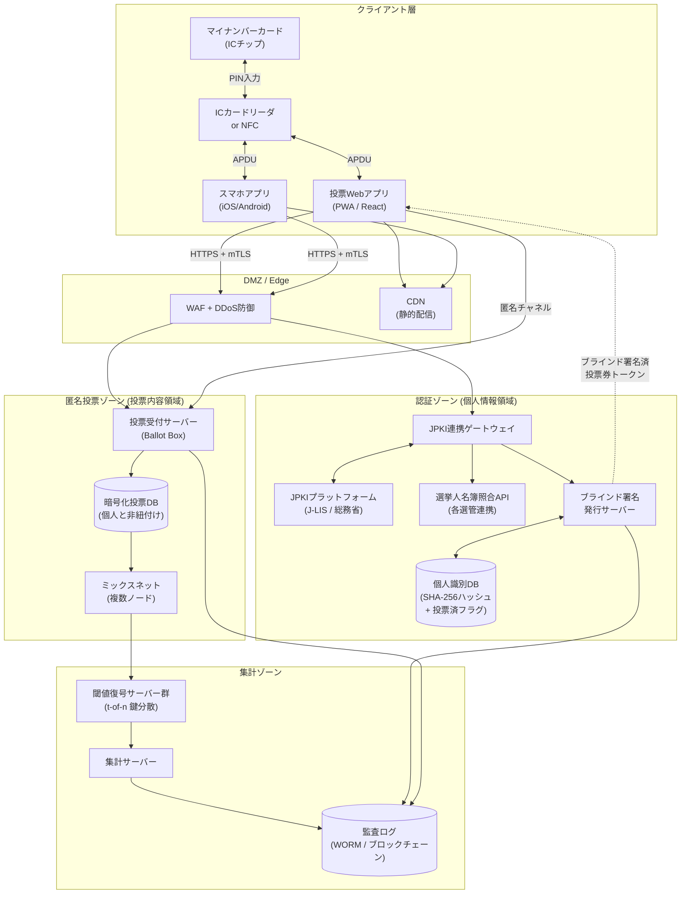

# マイナンバーカード活用 インターネット投票システム 設計書

**バージョン**: 1.0
**作成日**: 2026-05-17
**対象フェーズ**: 要件定義 / アーキテクチャ設計（実装は後続のCodexフェーズ）
**読者**: Codex（実装エージェント）／ バックエンド・フロントエンド開発者

---

## 1. システム概要と目的

### 1.1 目的
本システムは、日本の公職選挙（衆参両院議員選挙、地方選挙等）において、有権者が物理的な投票所へ赴くことなく、自宅等のインターネット環境からマイナンバーカードを用いて投票を行えるようにすることを目的とする。

### 1.2 設計の基本理念
公職選挙法（昭和25年法律第100号）の定める基本原則 ―― 普通選挙・平等選挙・**秘密投票**・直接選挙・自由選挙 ―― を、**従来の物理的な投票所運用の代わりに暗号学的プロトコルとシステム設計によって担保する**こと。

### 1.3 想定スケール
- 有権者数: 約1億人
- ピーク時同時アクセス: 200万RPS（投票締切1時間前を想定）
- 投票期間: 公示日翌日〜投票日20:00
- 可用性目標: 99.99%（投票期間中）

### 1.4 スコープ外
- マイナンバーカード自体の発行・失効管理（J-LIS所管）
- 選挙人名簿の本源的管理（市区町村選挙管理委員会所管 → 本システムはAPI連携利用）
- 開票結果の公式公示（中央選挙管理会の責任範囲）

---

## 2. システム構成図

### 2.1 全体アーキテクチャ（Mermaid）



### 2.2 セキュリティゾーン分離の原則
**赤ゾーン（個人情報）と青ゾーン（投票内容）は物理的にネットワークが分離される。** 両ゾーン間で授受される情報は、ブラインド署名された「投票券トークン」のみであり、当該トークンから投票者を逆引きすることは暗号学的に不可能である。

---

## 3. 主要コンポーネントの役割

### 3.1 フロントエンド（投票クライアント）
| 項目 | 仕様 |
|---|---|
| 形態 | PWA（Web）／ iOS・Androidネイティブアプリ |
| 技術 | React 18 + TypeScript / Swift / Kotlin |
| JPKI連携 | Web: 公的個人認証JPKIブラウザ拡張 + ICカードリーダ / Mobile: NFC経由でカード読取 |
| 主要責務 | ①利用者証明用電子証明書でログイン ②投票内容をクライアント側でElGamal暗号化 ③署名用電子証明書でブラインド化済投票券に署名要求 ④暗号化投票を匿名チャネル経由で送信 |
| 重要原則 | 投票内容の平文はクライアントメモリ外に出ない。サーバーには常に暗号文のみが送信される。 |

### 3.2 JPKI認証サーバー（JPKI Gateway）
- 役割: マイナンバーカード内の電子証明書を、J-LIS運営のJPKIプラットフォームに照会して検証する。
- 検証項目: 利用者証明用電子証明書の有効性（OCSP / CRL）、署名用電子証明書の有効性および署名検証、証明書失効リストとの突合
- 取得情報: 証明書シリアル番号、基本4情報（氏名・住所・生年月日・性別）※選挙人名簿照合時のみメモリ上で利用、永続化禁止
- 取得・保持禁止: 12桁のマイナンバー（個人番号）。入力フィールド自体を実装しない。

### 3.3 ブラインド署名発行サーバー
- 有権者であることが確認できた利用者に対し、ブラインド署名済の投票券トークンを1枚だけ発行する。
- 二重発行防止のため、ID_DBの「投票券発行済フラグ」をトランザクション内で更新。
- 発行サーバー自身は、署名した投票券の中身（盲化解除後の値）を知り得ない。

### 3.4 投票受付サーバー（Ballot Box）
- 暗号化された投票データ + ブラインド署名済投票券トークンを受け付ける。
- 検証ロジック:
  1. トークンの署名検証（発行サーバーの公開鍵で）
  2. トークンの二重使用チェック
  3. ゼロ知識証明検証（投票内容が候補者集合内であることのZKP）
- トークン受理時、送信元IPやセッション情報を投票データに紐づけない。

### 3.5 集計サーバー（ミックスネット + 閾値復号）
- ミックスネット: 複数の独立運用ノード（中央選管・最高裁・会計検査院・第三者監査機関）が各々再暗号化シャッフルを行う。
- 閾値復号: 投票締切後、t-of-n（5-of-7）の鍵共有者が集まって初めて復号できる。
- 準同型加算により合算暗号文を1回だけ復号し、候補者別票数のみ取得。

### 3.6 データベース
| DB名 | ゾーン | 内容 | 保護要件 |
|---|---|---|---|
| ID_DB | 認証ゾーン | 証明書シリアルのハッシュ、投票券発行済フラグ、選挙ID | TDE暗号化 + 行レベルアクセス制御 |
| VOTE_DB | 匿名投票ゾーン | 暗号化投票、ブラインド署名済トークン、受付タイムスタンプ（5分丸め） | 個人情報を一切含まない |
| AUDIT_LOG | 集計ゾーン | 全コンポーネントの操作ログをハッシュチェーンで連結（WORM） | 改ざん不可、複数地理冗長化 |

---

## 4. データモデル

### 4.1 個人識別DB（ID_DB） ※認証ゾーン

```sql
CREATE TABLE voter_status (
    voter_hash             CHAR(64)    PRIMARY KEY,   -- SHA-256(証明書シリアル || 選挙ID || ソルト)
    election_id            VARCHAR(32) NOT NULL,
    token_issued           BOOLEAN     NOT NULL DEFAULT FALSE,
    token_issued_at        TIMESTAMP,
    revote_count           INTEGER     NOT NULL DEFAULT 0,
    last_issued_token_hash CHAR(64),
    CONSTRAINT chk_election FOREIGN KEY (election_id) REFERENCES election(election_id)
);

CREATE INDEX idx_voter_election ON voter_status(election_id, token_issued);
```

このテーブルには投票内容も、誰に投票したかも一切記録されない。記録されるのは「投票券を受け取ったか否か」のみである。

### 4.2 暗号化投票DB（VOTE_DB） ※匿名投票ゾーン

```sql
CREATE TABLE ballot (
    ballot_id            UUID        PRIMARY KEY,
    election_id          VARCHAR(32) NOT NULL,
    blind_token          BYTEA       NOT NULL,
    blind_token_hash     CHAR(64)    NOT NULL,
    encrypted_vote       BYTEA       NOT NULL,           -- ElGamal暗号文 (c1, c2)
    zk_proof             BYTEA       NOT NULL,
    received_at_bucket   TIMESTAMP   NOT NULL,           -- 5分単位に丸めたタイムスタンプ
    sequence_in_bucket   INTEGER     NOT NULL,
    revote_serial        INTEGER     NOT NULL DEFAULT 1
);

CREATE UNIQUE INDEX idx_ballot_token_serial ON ballot(blind_token_hash, revote_serial);
```

個人情報との連結不可能性: voter_statusにはvoter_hashのみ、ballotにはblind_token_hashのみが格納される。両者の対応関係はブラインド署名の数学的性質により、発行サーバーですら復元不可能。

### 4.3 監査ログ（AUDIT_LOG）

```sql
CREATE TABLE audit_log (
    log_id          BIGSERIAL PRIMARY KEY,
    prev_hash       CHAR(64) NOT NULL,
    log_hash        CHAR(64) NOT NULL,  -- SHA-256(prev_hash || payload)
    component       VARCHAR(64) NOT NULL,
    event_type      VARCHAR(64) NOT NULL,
    payload         JSONB NOT NULL,     -- 個人特定情報・投票内容は含めない
    occurred_at     TIMESTAMP NOT NULL
);
```

---

## 5. 投票プロセスのシーケンス

```mermaid
sequenceDiagram
    actor V as 有権者
    participant C as 投票クライアント
    participant Card as マイナンバーカード
    participant JG as JPKIゲートウェイ
    participant JP as J-LIS / JPKI基盤
    participant BS as ブラインド署名発行サーバー
    participant IDB as ID_DB
    participant BB as 投票受付サーバー
    participant VDB as VOTE_DB
    participant MX as ミックスネット
    participant DA as 閾値復号サーバー群
    participant T as 集計サーバー

    V->>C: アプリ起動・候補者一覧表示
    V->>Card: 利用者証明用PIN(4桁)入力
    Card->>C: 利用者証明用電子証明書
    C->>JG: ログイン要求(証明書)
    JG->>JP: 証明書検証(OCSP)
    JP-->>JG: 有効
    JG->>IDB: voter_hash算出・選挙人名簿照合
    JG-->>C: セッション確立(短命JWT)

    V->>C: 候補者選択
    Note over C: クライアント側でElGamal暗号化<br/>盲化因子rで blinded を生成

    V->>Card: 署名用PIN(英数字6-16桁)入力
    Card->>C: blinded への署名 σ_blind
    C->>JG: 投票券発行要求
    JG->>BS: 転送
    BS->>IDB: BEGIN TX; SELECT token_issued FOR UPDATE
    BS->>BS: ブラインド署名 σ_token = sign_blind(blinded)
    BS->>IDB: UPDATE token_issued=TRUE; COMMIT
    BS-->>C: σ_token

    Note over C: 盲化解除 token = unblind(σ_token, r)

    C->>BB: POST /ballot {encrypted_vote, token, zk_proof}
    BB->>BB: token署名検証 + ZKP検証 + 重複チェック
    BB->>VDB: INSERT ballot
    BB-->>C: 受領証(ballot_idハッシュ)

    Note over V,T: ===== 投票期間終了 =====

    VDB->>MX: 全暗号化投票を入力
    loop ノード毎(N回)
        MX->>MX: 再暗号化シャッフル
    end
    MX->>DA: シャッフル済暗号文
    Note over DA: t-of-n の鍵共有者が集合
    DA->>T: 候補者別票数（平文）
    T->>T: 結果確定・公示
```

### 5.1 上書き投票（強要対策）
- 投票期間中、同一voter_hashから複数回の投票券発行を許容する（revote_count++）。
- 投票受付サーバーは同一blind_token_hashの票をrevote_serialを増やしながら受理する。
- 集計直前のミックスネット投入前段で、各トークンにつき最大revote_serialの票のみを採用する。

---

## 6. セキュリティおよびプライバシー保護の仕様

### 6.1 暗号プリミティブ選定

| 用途 | アルゴリズム | パラメータ |
|---|---|---|
| 投票内容暗号化 | Exponential ElGamal（楕円曲線版） | secp256r1 または Curve25519 |
| ブラインド署名 | RSA Blind Signature (RFC 9474) | RSA-3072 / SHA-384 |
| 鍵共有 | Shamir閾値秘密分散 + DKG | t=5, n=7 |
| ゼロ知識証明 | 非対話型シグマプロトコル(Chaum-Pedersen) | 候補者集合内であることの証明 |
| 通信路 | TLS 1.3 + mTLS | PFS必須 |
| ハッシュ | SHA-256 / SHA-3-256 | ソルト32バイト |
| クライアント鍵保護 | マイナンバーカードICチップ内蔵 | 外部抽出不可 |

### 6.2 ネットワーク分離
認証ゾーンと匿名投票ゾーンは異なるAS・異なるVPC・異なる運用主体に配置する。両ゾーン間のデータ授受はブラインド署名トークンのみ、かつクライアント経由でのみ行う。

### 6.3 匿名化チャネル
クライアント → 投票受付サーバーの通信は複数の独立した中継ノードを経由。受付タイムスタンプは5分バケットに丸め、バケット内順序を撹乱して保存。

### 6.4 ゼロ知識証明
クライアントは、暗号化投票が「定義された候補者集合のいずれかである」ことを証明するZKPを添付する。

### 6.5 End-to-End検証可能性
- Cast-as-Intended: 確認画面で復号せず再暗号化整合性チェック
- Recorded-as-Cast: 公開掲示板でballot_idによる掲載確認
- Tallied-as-Recorded: ミックスネット・復号の正当性証明を公開

### 6.6 鍵管理
選挙公開鍵 pk_election は分散鍵生成(DKG)プロトコルで生成。秘密鍵 sk_election はShamir分散により7機関に分割保管。t=5 機関の合意なしには如何なる票も復号不可能。

### 6.7 個人番号の不取得（マイナンバー法準拠）
- アプリのいかなる画面にも「12桁のマイナンバー」入力欄を設けない（UIレベルでの保証）。
- バックエンドのAPIスキーマに mynumber フィールドを定義しない（OpenAPI Linterで強制）。
- JPKIから取得するのは電子証明書のみ。
- 識別子は SHA-256(証明書シリアル || 選挙ID || ソルト) で選挙毎に異なるハッシュとし、選挙横断的な名寄せを不可能化。

### 6.8 脅威モデル対応一覧

| 脅威 | 対応策 |
|---|---|
| クライアントマルウェアによる投票内容窃取 | カード内秘密鍵は抽出不可。投票先改ざんは上書き投票で緩和。 |
| 受付サーバー管理者による票閲覧 | 票はElGamal暗号文。閾値復号鍵なしでは解読不可。 |
| DBダンプ流出 | 投票DBは個人情報を一切持たない。識別DBは投票内容を一切持たない。 |
| 二重投票 | ブラインド署名発行時の楽観ロック + トークン重複チェック + revote_serial |
| DoS攻撃 | WAF + Anycast CDN + レート制限 + 投票期間長期化 |
| 内部関係者による集計改ざん | 閾値復号 + 公開検証可能性 + ハッシュチェーン監査ログ |
| マイナンバー情報の漏洩 | マイナンバー自体を入力・取得・保存しない設計により発生し得ない |

---

## 7. 公職選挙法 ↔ システム要件 対応表

| 条文 | 原則 | システム上の担保 |
|---|---|---|
| 第9条 | 選挙権（年齢・国籍要件） | JPKI基本4情報 + 選挙人名簿API照合 |
| 第11条 | 選挙権を有しない者 | 選管管理の欠格者リストとの突合 |
| 第36条 | 一人一票 | voter_status.token_issuedのFOR UPDATE排他制御 + blind_token_hash UNIQUE制約 |
| 第42条 | 選挙人名簿登録者のみ投票可 | JPKIゲートウェイで選挙人名簿照合API呼出 |
| 第44条 | 投票所投票主義（→本システムで代替） | 投票クライアントを「電子投票所」と定義 |
| 第46条 | 秘密投票 | ElGamal暗号化、ブラインド署名、ミックスネット、閾値復号、DB物理分離 |
| 第48条の2 | 期日前投票 | 投票期間中いつでも投票可能。上書き投票で強要対策も兼ねる |
| 第49条 | 不在者投票 | 居所に関わらず投票可能 |
| 第50条 | 投票拒否（二重投票防止） | token_issued=TRUE 時に物理投票所と相互排他API連携 |
| 第52条 | 投票の秘密侵害禁止 | 内部監査ログにも個人と票の対応は記録不可 |
| 第55条 | 投票箱の閉鎖 | 投票期間終了時にVOTE_DBをread-onlyに切替 |
| 第66条 | 開票 | 閾値復号 + 集計サーバーで自動化 |
| 第68条 | 無効投票 | ZKP検証失敗・形式不正は無効として別カウント |
| 第205条 | 選挙の効力に関する異議 | E2E検証可能性 + AUDIT_LOG（WORM）で証拠保全 |
| 第221-225条 | 買収・投票強要罪 | 上書き投票で書き換え可能とすることで強要を実効性のないものに |
| マイナンバー法第19条 | 個人番号の利用制限 | 個人番号を一切取得しない設計により本条の適用外 |

---

## 8. Codex実装フェーズへの引き継ぎ事項

### 8.1 実装単位の分割
1. jpki-gateway (Go / Java) — JPKI連携・選挙人照合
2. blind-signer (Rust) — ブラインド署名発行、HSM連携
3. ballot-box (Go) — 投票受付、ZKP検証
4. mixnet-node (Rust) — 再暗号化シャッフル（複数インスタンス）
5. threshold-decryptor (Rust) — 閾値復号
6. tally (Go) — 集計・公示
7. client-web (TypeScript / React) — PWA
8. client-mobile (Swift / Kotlin) — ネイティブアプリ
9. bulletin-board (Go) — 公開検証用掲示板

### 8.2 IF定義
各モジュール間IFはOpenAPI 3.1 / Protocol Buffersで先行定義する。

### 8.3 暗号ライブラリ
枯れたものを使用する（独自実装禁止）。
- ElGamal: ristretto255 ベース
- ブラインド署名: RustCrypto/RSA + RFC 9474
- ZKP: dalek-cryptography/zkp クレート

### 8.4 テスト要件
- 各暗号プロトコルにつきプロパティベーステスト
- カオステスト（コンポーネント単体障害時に投票が失われないこと）
- 1000万票規模の負荷試験
